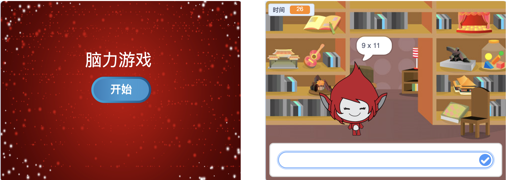

--- challenge ---
## 挑战：开始画面
你能否向你的工作区添加另一背景，作为你的游戏开始画面？你可以使用`when I receive start`（我收到开始时）{:class="blockevents"} 和`when I receive end`（我收到结束时）{:class="blockevents"} 模块切换背景。

你还可以运用这些模块显示和隐藏你的角色，甚至显示和隐藏你的计时器：

```blocks
显示变量 [time v]
```
```blocks
隐藏变量 [time v]
```




--- /challenge ---