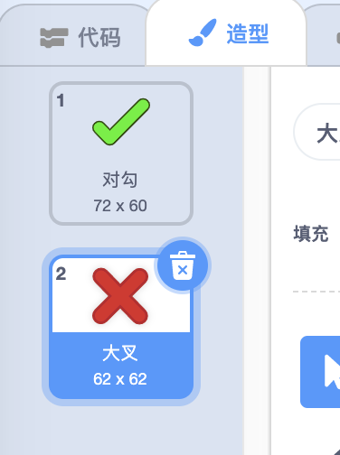
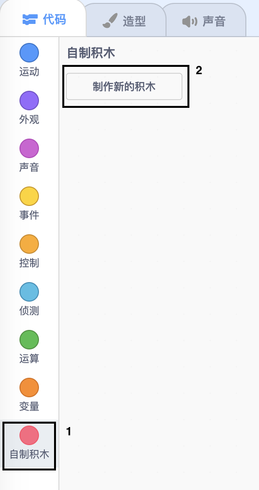
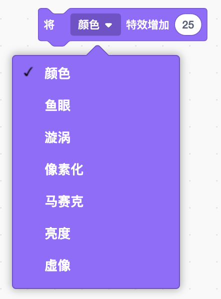

## 添加图形

此刻，角色精灵只根据玩家的答案说`对！ :) `或`不对:( `。添加一些图形，让玩家知道他们的答案是正确还是错误。

\--- task \---

创建一个名为“结果”的新精灵，并为其赋予“对勾/检查”和“叉”的外观。



\--- /task \---

\--- task \---

更改角色精灵的代码，使它`不再向玩家说些什么，而是广播` {:class =“ block3events”}“正确”或“错误”的消息。


```blocks3
如果 <(回答) = ((数字1)*(数字2))> 那么

- 说 [对! :)] (2) 秒
+ 广播 (正确 v)
否则
- 说 [不对 :(] (2) 秒
+ 广播 (错误 v)
end
```

\--- /task \---

\--- task \---

现在，您可以用这些消息来`显示` {:class =“ block3looks”}”对勾“或”叉“。将以下代码添加到“结果”精灵中：


```blocks3
    当接收到 [正确 v]
    换成 (对勾 v) 造型
    显示
    等待 (1) 秒
    隐藏

    当接收到 [错误 v]
    换成 (叉 v) 造型
    显示
    等待 (1) 秒
    隐藏

    当 ⚑ 被点击
    隐藏
```

\--- /task \---

\--- task \---

再次测试您的游戏。每当您正确回答问题时，您都应该看到对勾；而当您回答错误时，您将看到叉号！


\--- /task \---

您注意到`当接收到正确`{:class="block3events"}和`当接收到错误`{:class="block3events"}的代码几乎相同吗？

所以您可以更容易地更改代码，去创建一个自定义积木。

\--- task \---

选择“结果”精灵。 然后点击`自制积木` {:class=" block3myblocks"}，以及**制作新的积木** 。 创建一个新的积木并将其命名为`动画`{:class="block3myblocks"}。




\--- /task \---

\--- task \---

将`显示`{:class="block3looks"}与`隐藏`{:class="block3looks"}“结果”精灵的代码移到`动画`{:class="block3myblocks"}积木中。


```blocks3
定义 动画
显示
等待 (1) 秒
隐藏
```

\--- /task \---

\--- task \---

确保在**两个** `换成造型`{:class="block3looks"}积木下面移除了`显示`{:class="block3looks"}和`隐藏`{:class="block3looks"}积木。

然后在两个`换成造型`{:class="block3looks"}积木下面添加`动画`{:class="block3myblocks"}积木。您的代码现在应如下所示：


```blocks3
    当接收到 [正确 v]
    换成 (对勾 v) 造型
    动画:: custom

    当接收到 [错误 v]
    换成 (叉 v) 造型
    动画:: custom
```

\--- /task \---

由于 `动画`{:class="block3myblocks"}积木是自定义的， 如果你想要“结果”显示的时间更长或更短，现在只需要对你的代码做简单修改，。

\--- task \---

更改您的代码，以使“ 对勾”或“叉号”显示2秒钟。

\--- /task \---

\--- task \---

你可以修改你的` 动画`积木，使得“对勾”与“叉号”淡入淡出，而不是直接`显示`{:class="block3looks"}或`隐藏`{:class="block3looks"} 。


```blocks3
    定义 动画
    将 [虚像 v] 特效设定为 (100)
    显示
    重复执行 (25)
        将 [虚像 v] 特效增加 (-4)
    end
    隐藏
```

\--- /task \---

您能改进“对勾”或“叉”图形动画吗？ 您可以添加代码使造型淡出。或者您可以使用其他酷炫效果：

