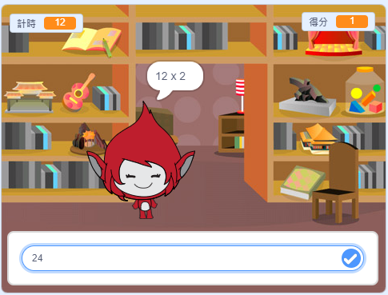

\---沒有印刷\---

這是該項目的 **Scratch 3** 版本。項目</a>還有 Scratch 2版本。
 

\--- /無印刷\---

## 介紹

在這個項目中，你將創建一個數學測驗遊戲，玩家有30秒的時間給出盡可能多的正確答案。

### 你要做什麼

\--- no-print \--- 單擊按鈕開始。輸入問題的答案，然後按 <kbd>Enter</kbd> 鍵。

  <iframe allowtransparency="true" width="485" height="402" src="https://scratch.mit.edu/projects/embed/250234955/?autostart=false" frameborder="0" scrolling="no"></iframe>
  

\--- /無印刷\---

\---僅打印\---  \--- /僅打印\---

## - - 坍方 - -

## 標題：你將學到什麼

+ 如何在Scratch中使用廣播
+ 如何創建和使用自定義Scratch塊

- - /坍方 - -

## - - 坍方 - -

## 標題：你需要什麼

### 硬件

+ 能夠運行Scratch 3的計算機

### 軟件

+ 從頭開始3（ [在線](http://rpf.io/scratchon){：target =“_ blank”}或 [離線](http://rpf.io/scratchoff){：target =“_ blank”}）

- - /坍方 - -

## - - 坍方 - -

## 標題：教育工作者的附加說明

\--- no-print \--- 如果您需要打印此項目，請使用 [個適合打印的版本](https://projects.raspberrypi.org/en/projects/brain-game/print)。 \--- /無印刷\---

在這裡找到這個項目的 [解決方案](http://rpf.io/p/en/brain-game-get){：target =“_ blank”}。

- - /坍方 - -