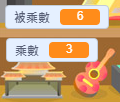

## 創建問題

您將首先創建玩家必須回答的隨機問題。

\---任務\---

打開一個新的Scratch項目。

**Online:** open a new online Scratch project at [rpf.io/scratch-new](http://rpf.io/scratchon){:target="_blank"}.

**離線：** 在離線編輯器中打開一個新項目。

如果您需要下載並安裝Scratch離線編輯器，可以在 [rpf.io/scratchoff](http://rpf.io/scratchoff){：target =“_ blank”}找到它。

\--- /任務\---

\--- task \--- 為你的遊戲添加角色精靈和背景。你可以選擇任何你喜歡的！這是一個例子：


\--- /任務\---

\--- task \--- 確保選擇了你的角色精靈。 創建兩個新變量，稱為 `number 1`{：class =“block3variables”}和 `number 2`{：class =“block3variables”}，以存儲測驗問題的數字。

 

[[[generic-scratch3-add-variable]]]

\--- /任務\---

\--- task \--- 在你的角色精靈中添加代碼，將 `變量`{：class =“block3variables”}設置為2到12之間的 `隨機`{：class =“block3operators”}數字。


```blocks3
當標記點擊時
設置[數字1 v]到（選擇隨機（2）到（12））
設置[數字2 v]到（選擇隨機（2）到（12））
```

\--- /任務\---

\---任務\--- 添加代碼 `問`{：class =“block3sensing”}玩家的答案，然後 `說2秒`{：class =“block3looks”}答案是否正確或錯誤：


```blocks3
當標記點擊時
設置[數字1 v]到（選擇隨機（2）到（12））
設置[數字2 v]到（選擇隨機（2）到（12））

+問（加入（數字1）） （加入[x]（數字2）））並等待
+如果 <（回答）=（（數字1）*（數字2））> 然後
+說[是！ :)] for（2）seconds
+ else
+ say [no :(] for（2）seconds
+ end
```

\--- /任務\---

\---任務\---

測試您的項目兩次：正確回答一個問題，另一個錯誤回答。

\--- /任務\---

\---任務\---

在此代碼周圍添加 `永遠`{：class =“block3control”}循環，以便遊戲連續向玩家詢問很多問題。

\---提示\--- \---提示\---

你需要添加一個 `永遠`{：class =“block3control”}塊，並將標記點擊</code>{{class =“block3control”}塊時除 `之外的所有代碼放入其中。</p>

<p>--- /提示---
---提示---
這是你需要的塊：</p>

<pre><code class="blocks3">永遠
結束
`</pre> 

\--- /提示\--- \---提示\--- 這是你的代碼應該是這樣的：

```blocks3
當標誌點擊

+永遠
    集[數字1 v]到（挑選隨機（2）到（12））
    設置[數字2 v]到（挑選隨機（2）到（12））
    問（加入（數字） 1）（加入[x]（數字2）））並等待
    如果 <（回答）=（（數字1）*（數字2））> 然後
        說[是！ :)] for（2）秒
    else
        說[no :(] for（2）seconds
    end
end
```

\--- /提示\--- \--- /提示\---

\--- /任務\---