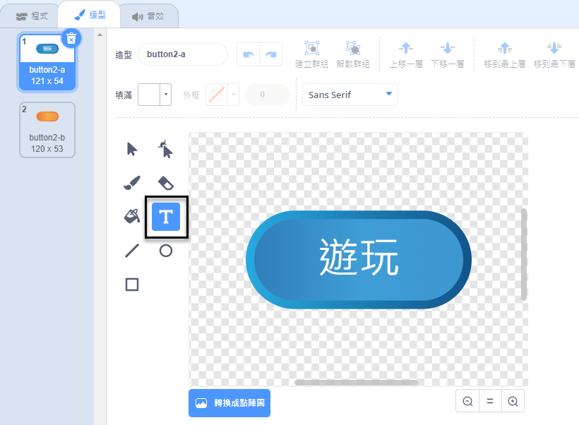
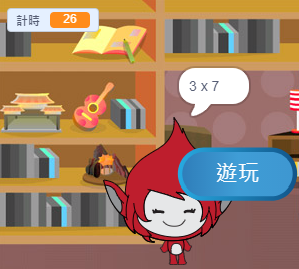
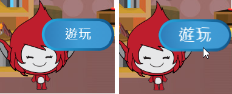

## 多場比賽

現在，您將添加一個“播放”按鈕，以便玩家可以多次玩遊戲。

\--- task \--- 創建一個新的'Play'按鈕精靈，玩家需要點擊該精靈才能開始新的遊戲。

您可以自己繪製精靈，也可以從庫中編輯精靈。



\--- /任務\---

\--- task \--- 將此代碼添加到按鈕精靈中：


```blocks3
    當標記點擊時
    顯示

    當此精靈點擊時
    隱藏
    廣播（開始v）
```

\--- /任務\---

新代碼包括另一個 `廣播`{：class =“block3events”}塊，它發送消息'start'。

當玩家點擊旗幟時，新代碼會顯示“播放”按鈕精靈。 當玩家點擊按鈕精靈時，精靈會隱藏然後廣播其他精靈可以做出反應的消息。

此時，角色精靈在玩家點擊旗幟時開始提問。 讓性格精靈開始提問的時候它接收到'開始'更改遊戲的代碼 `廣播`{：類=“block3events”}。

\--- \---任務 選擇你的性格精靈和，在其代碼部分中替換 `時標誌點擊`{：類=“block3events”}與塊 `時收到開始`{：類=“block3events”阻止。


```blocks3
<br />- 當標誌點擊
+當我收到[start v]
set [number 1 v] to（pick random（2）to（12））
set [number 2 v] to（pick random（2）to（12） ）
問（加入（數字1）（加入[x]（數字2）））並等待
如果 &lt;（回答）=（（數字1）*（數字2））&gt; 然後
    說[是！ :)] for（2）秒
else
    說[nope :(] for（2）秒
結束
```

\--- /任務\---

\---任務\---

單擊綠色標記，然後單擊新的“播放”按鈕以測試它是否有效。您應該看到在單擊按鈕之前遊戲沒有啟動。

\--- /任務\---

你能看到點擊綠色標誌時計時器開始，而不是遊戲開始時？



\---任務\---

你可以更改計時器的代碼，以便在玩家點擊按鈕時啟動計時器嗎？

\--- /任務\---

\--- task \--- 將代碼添加到按鈕精靈中，以便在每個遊戲結束時再次顯示該按鈕。


```blocks3
    當我收到[結束v]
    節目
```

\--- /任務\---

\---任務\---

通過玩幾個遊戲來測試“播放”按鈕。該按鈕應在每場比賽結束時顯示。

要更快地測試遊戲，您可以更改 `時間`{：class =“block3variables”}的值，以便每個遊戲只有幾秒鐘。


```blocks3
    將[時間v]設置為 [10]
```

\--- /任務\---

\--- task \--- 您可以更改鼠標指針懸停在按鈕上時按鈕的外觀。


```blocks3
    當標誌點擊
    顯示
    永遠
    如果 <touching (mouse-pointer v)?> 然後
        設置[魚眼v]效果到（30）
    否則
        設置[魚眼v]效果到（0）
    結束
    結束
```

 \--- /任務\---