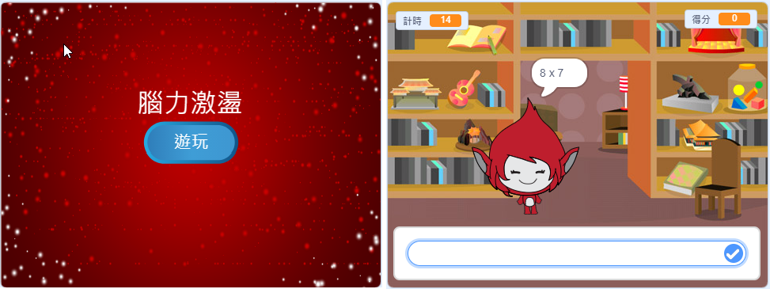

## 挑戰：創建一個開始屏幕

你能添加另一個背景，它將成為遊戲的開始畫面嗎？

可以使用 `時收到開始`{：類=“block3events”}和 `，當我接收端`{：類=“block3events”}塊到背景之間切換。

要在遊戲在背景之間切換時顯示或隱藏角色，您可以使用 `show`{：class =“block3looks”}和 `隱藏`{：class =“block3looks”}塊。

要在遊戲在背景之間切換時顯示或隱藏計時器和分數，您可以使用 `show variable`{：class =“block3variables”}和 `隱藏變量`{：class =“block3variables”}塊。

