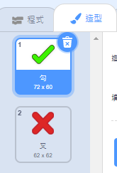
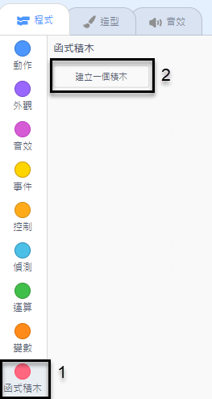
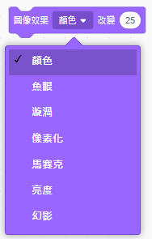

## 添加圖形

目前，角色精靈只是說 `是的！ :)` 或 `否:(` 到玩家的答案。添加一些圖形讓玩家知道他們的答案是正確還是不正確。

\---任務\---

創建一個名為'Result'的新精靈，並給它一個'tick / check'和'cross'服裝。



\--- /任務\---

\---任務\---

改變你的性格精靈的代碼，這樣，而不是說事的球員，這 `播放`{：類=“block3events”}消息“正確”或“錯誤”。


```blocks3
如果 <（回答）=（（數字1）*（數字2））> 然後

- 說[是的！ :)] for（2）秒
+廣播（正確v）
其他
- 說[nope :(] for（2）秒
+廣播（錯誤v）
結束
```

\--- /任務\---

\---任務\---

現在，您可以使用這些消息 `顯示`{：類=“block3looks”}的'滴答'或'交叉'服裝。將以下代碼添加到'Result'精靈：


```blocks3
    當我收到[正確的v]
    開關服裝（勾選v）
    顯示
    等待（1）秒
    隱藏

    當我收到[錯誤的v]
    開關服裝到（交叉v）
    顯示
    等待（1）秒
    當標記點擊
    隱藏時隱藏


```

\--- /任務\---

\---任務\--- 再次測試你的遊戲。每當你正確回答問題時，你應該看到勾號，而當你回答錯誤時，你應該看到十字架！


\--- /任務\---

你可以看到，代碼 `的時候我收到正確的`{：類=“block3events”}和 `，當我收到錯誤`{：類=“block3events”}幾乎相同？

因此，您可以更輕鬆地更改代碼，您將創建自定義塊。

\---任務\---

選擇“結果”精靈。 然後單擊 `My Blocks`{：class =“block3myblocks”}，然後單擊 **一個Block**。 創建一個新塊並將其命名為 `animate`{：class =“block3myblocks”}。




\--- /任務\---

\--- task \--- 將代碼移動到 `顯示`{：class =“block3looks”}並將 `隱藏`{：class =“block3looks”}'結果'精靈放入 `動畫`{：class =“ block3myblocks“}阻止：


```blocks3
定義動畫
顯示
等待（1）秒
隱藏
```

\--- /任務\---

\---任務\--- 確保你已經刪除了 `節目`{：class =“block3looks”}和 `隱藏`{{class =“block3looks”}塊以下 **** 個 `開關服裝`{： class =“block3looks”}塊。

然後在 `開關服裝`{：class =“block3looks”}塊下面添加 `animate`{：class =“block3myblocks”}塊。您的代碼現在應該如下所示：


```blocks3
    當我收到[正確的v]
    開關服裝（勾選v）
    animate :: custom

    當我收到[錯誤的v]
    開關服裝到（交叉v）
    animate :: custom
```

\--- /任務\---

由於自定義 `動畫`{：class =“block3myblocks”}阻止，如果您想要更長或更短的時間顯示“結果”精靈的服裝，您現在只需要對代碼進行一次更改。

\---任務\---

更改您的代碼，以便'tick'或'cross'服裝顯示2秒鐘。

\--- /任務\---

\--- task \--- 而不是 `顯示`{：class =“block3looks”}和 `隱藏`{：class =“block3looks”}'tick'或'cross'服飾，你可以改變你的 `animate`{：class =“block3myblocks”}阻止服裝淡入。


```blocks3
    定義動畫
    集[鬼v]效果到（100）
    表示
    重複（25）
        變化[鬼v]效果由（-4）
    結束
    隱藏
```

\--- /任務\---

你能改進'tick'或'cross'圖形的動畫嗎？您可以添加代碼以使服裝淡出，或者您可以使用其他很酷的效果：

